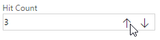

# Plus/Minus Custom Control for the Work Item Form

This extension adds a plus/minus component to an input field, allowing the user to change the field value with a button instead of typing.



## Features
- Plus/minus buttons for integer and double fields  
- Keyboard shortcuts support (arrow keys)
- Works with Azure DevOps Services and Server

## Development

### Prerequisites
- Node.js 18+ and npm
- Azure DevOps Extension CLI: `npm install -g tfx-cli`

### Build and Package
```bash
# Install dependencies
npm install

# Development build
npm run build

# Development package (creates .vsix file)
npm run package-dev

# Production build and package
npm run package-release

# Run tests
npm test
```

### Project Structure
```
src/                    # Modern TypeScript source files
├── app.ts             # Main application entry point
├── control.ts         # Controller logic
├── model.ts          # Business logic and data model
├── view.ts           # UI rendering
└── errorView.ts      # Error handling

dist/                  # Webpack build output
test/                  # Unit tests
azure-devops-extension.json  # Extension manifest
```

### Technology Stack
- **Azure DevOps Extension SDK 4.0.2** - Modern extension development
- **Azure DevOps Extension API 4.241.0** - Latest API surface  
- **TypeScript 5.6.3** - Type-safe development with strict compilation
- **Webpack 5** - Modern bundling and optimization
- **Mocha + Chai** - Comprehensive testing framework
- **Zero security vulnerabilities** - All dependencies up-to-date

## VS Code Integration

The project includes VS Code configuration for optimal development experience:
- **Build Tasks**: Use Ctrl+Shift+P → "Tasks: Run Task" to access build commands
- **TypeScript IntelliSense**: Full type checking and auto-completion  
- **Problem Matcher**: Integrated error reporting from webpack and TypeScript
- **Debugging Support**: Source maps for debugging bundled code


# Documentation 

You can learn how to setup and use the extension from the documentation in the Azure DevOps [Marketplace](https://marketplace.visualstudio.com/items?itemName=ms-devlabs.hitcount-control). 

# Support

## How to file issues and get help

This project uses [GitHub Issues](https://github.com/Microsoft/vsts-extension-integer-control/issues) to track bugs and feature requests. Please search the existing issues before filing new issues to avoid duplicates. For new issues, file your bug or feature request as a new Issue. 

## Microsoft Support Policy

Support for this project is limited to the resources listed above.

# Contributing

We welcome contributions to improve the extension. If you would like to contribute, please fork the repository and create a pull request with your changes. Your 
contributions help enhance the functionality and usability of the extension for the entire community.

**Note:** do not publish the extension as a public extension under a different publisher as this will create a clone of the extension and it will be unclear to the 
community which one to use. If you feel you don't want to contribute to this repository then publish a private version for your use-case.

Check out https://learn.microsoft.com/en-us/azure/devops/extend/get-started to learn how to develop Azure DevOps extensions and https://www.visualstudio.com/en-us/docs/integrate/extensions/develop/custom-control to learn how to build your own custom control for the work item form..

## Building the Extension

### Quick Start
1. **Clone the repository**
   ```bash
   git clone https://github.com/Microsoft/vsts-extension-integer-control.git
   cd vsts-extension-integer-control
   ```

2. **Install dependencies**
   ```bash
   npm install
   ```

3. **Build and package**
   ```bash
   # Development build and package  
   npm run package-dev
   
   # Or production build and package
   npm run package-release
   ```

### Installation in Azure DevOps
1. Navigate to your Azure DevOps organization
2. Go to **Organization settings** → **Extensions** → **Manage extensions**
3. Click **Upload new extension** and select the generated `.vsix` file
4. Install the extension in your organization
5. Add the control to work item forms through the process customization

### Available npm Commands
```bash
npm run build          # Development build (creates dist/app.js)
npm run build:release  # Production build (minified)
npm run test          # Run unit tests  
npm run package-dev   # Create development .vsix package
npm run package-release # Create production .vsix package
npm run clean         # Clean build output
```

## Build System

This extension uses a modern **Webpack-based build system** that replaced the legacy Grunt setup:

### Build Process
- **TypeScript Compilation**: Source files in `src/` compiled with strict type checking
- **Webpack Bundling**: Creates optimized `dist/app.js` bundle
- **Source Maps**: Available for debugging in both development and production
- **Hot Reloading**: Fast incremental builds during development

### VS Code Integration
Use the built-in VS Code tasks (Ctrl+Shift+P → "Tasks: Run Task"):
- **Build**: Development webpack build
- **Build:Release**: Production webpack build with minification  
- **Test**: Run complete test suite
- **Package-Dev**: Build and create development .vsix
- **Package-Release**: Build and create production .vsix


## Unit Testing

The project includes comprehensive unit tests using **Mocha** and **Chai**:

### Running Tests
```bash
# Run all tests
npm test

# Tests are located in test/model.test.ts
```

# About Microsoft DevLabs

Microsoft DevLabs is an outlet for experiments from Microsoft, experiments that represent some of the latest ideas around developer tools. Solutions in this 
category are designed for broad usage, and you are encouraged to use and provide feedback on them; however, these extensions are not supported nor are any commitments made as to their longevity.