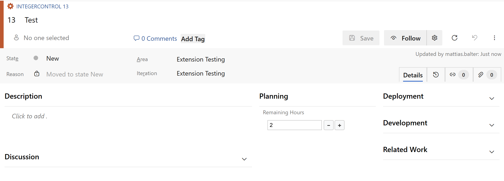

> This extension is currently only available on Azure DevOps Services and Azure DevOps Server 2019 or later.

# Make integer fields more interactive

# Increase/decrease counters with a single click

# Documentation

## Azure DevOps Services

Navigate to your work item form customization page and add a plus/minus integer control.

Edit the control so it can use the right integer field.

## Azure DevOps/TFS On-Premise 

The version published to the Azure DevOps Marketplace only supports Azure DevOps Server 2019.

If you want to use this extension for an older version of TFS then you need to manually build and publish the extension after changing the category in the extension manifest to:

    "categories": [
       "Plan and Track"
    ],

[Learn more](https://github.com/Microsoft/vsts-extension-integer-control/blob/master/README.md) about how to customize the integer control directly on XML.

# Source code 

The [source](https://github.com/Microsoft/vsts-extension-integer-control) for this extension can be found on Github - feel free to take, fork and extend. 

You can also learn how to build your own custom control extension for the work item form [here](https://www.visualstudio.com/en-us/docs/integrate/extensions/develop/custom-control). 

# Contributors

We thank the following contributor(s) for this extension: Alison Chow, Maria McLaughlin and Nelson Troncoso Aldas. 

# Support

## How to file issues and get help

This project uses [GitHub Issues](https://github.com/Microsoft/vsts-extension-integer-control/issues) to track bugs and feature requests. Please search the existing issues before filing new issues to avoid duplicates. For new issues, file your bug or feature request as a new Issue. 

## Microsoft Support Policy

Support for this project is limited to the resources listed above
